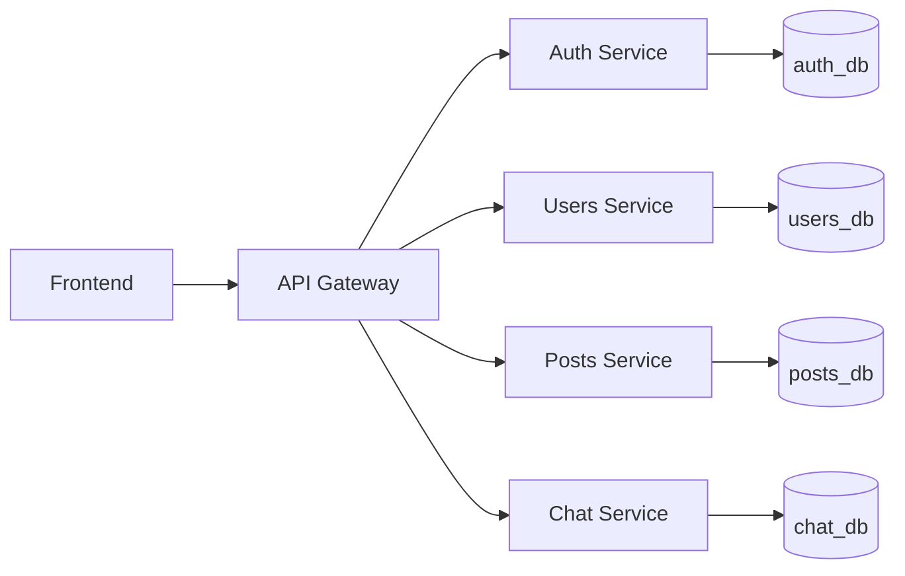

# Backend como Microservicios

## Resumen
El backend se divide en cinco servicios: gateway, auth, users, posts y chat. Esta estructura reduce el acoplamiento entre dominios, mantiene cada base de código centrada en una sola responsabilidad y facilita el mantenimiento y la evaluación del proyecto.

Cada servicio expone una interfaz HTTP clara y es propietario de su propio modelo de datos. El servicio auth gestiona autenticación y validación de tokens, el servicio users administra perfiles y relaciones sociales, el servicio posts administra publicaciones y reacciones, y el servicio chat gestiona conversaciones y mensajes. El gateway actúa como punto de entrada para el frontend y coordina las peticiones entre servicios.

Este diseño sigue el principio de responsabilidad única a nivel de servicio. También mantiene explícitos los contratos internos: los servicios se comunican mediante endpoints REST definidos y DTOs/shared contracts, en lugar de acceder directamente a la base de datos de otros servicios o compartir lógica de persistencia.

## Diagrama de Arquitectura

## Responsabilidades de los Servicios
El gateway es el punto de entrada público. Expone la superficie HTTP principal del backend, reenvía peticiones a los servicios internos, aplica manejo centralizado de timeouts y reintentos mediante un cliente HTTP compartido, y agrega la información de salud de los servicios.

El servicio auth es propietario de la autenticación: registro, inicio de sesión, cierre de sesión, refresh tokens, validación de tokens y el flujo de OAuth 42. Expone rutas como `/auth/register`, `/auth/login`, `/auth/refresh`, `/auth/logout`, `/auth/validate`, `/auth/42`, `/auth/42/callback` y `/health`. Su base de datos almacena los usuarios y refresh tokens necesarios para autenticación.

El servicio users es propietario de los datos de perfil y sociales. Gestiona perfiles de usuario, sincronización de perfiles mediante OAuth y amistades. Expone rutas como `/users/*`, `/friends/*` y `/health`. Su base de datos almacena la información necesaria para la identidad del usuario y las funcionalidades de perfil.

El servicio posts es propietario de las publicaciones y sus interacciones. Gestiona el feed, publicaciones, favoritos, likes y comentarios. Expone rutas como `/posts/*` y `/health`. Su base de datos almacena el contenido social y snapshots mínimos del autor.

El servicio chat es propietario del comportamiento de mensajería. Gestiona conversaciones y mensajes a través de rutas como `/chat/conversations`, `/chat/conversations/:conversationId/messages` y `/chat/health`. Su base de datos almacena conversaciones y mensajes del chat.

Esta separación mejora el mantenimiento porque los cambios en un dominio no requieren cambios coordinados en dominios no relacionados.

## Comunicación entre Servicios
La comunicación entre servicios se realiza mediante APIs REST. El gateway orquesta las peticiones hacia los servicios auth, users y chat usando llamadas HTTP síncronas. Los DTOs y contratos compartidos en `backend/shared` definen los datos intercambiados entre fronteras de servicio y mantienen consistentes las estructuras de request y response.

La arquitectura actual satisface el requisito del módulo de usar APIs REST o colas de mensajes para la comunicación. Actualmente usamos APIs REST e intencionalmente no usamos un message broker porque nuestros casos de uso actuales son síncronos.

El gateway usa un cliente HTTP centralizado con timeouts de petición y reintentos con backoff exponencial, lo que mantiene las llamadas entre servicios consistentes y más fáciles de mantener.

## Tabla de Servicios
| Servicio | Responsabilidad | Base de datos | Interfaz |
|----------|----------------|---------------|----------|
| auth | Autenticación, ciclo de vida de tokens, OAuth 42, validación de tokens | `auth_db` | REST |
| users | Perfiles, amistades, sincronización de perfil por OAuth | `users_db` | REST |
| posts | Publicaciones, feed, favoritos, likes, comentarios | `posts_db` | REST |
| chat | Conversaciones y mensajes | `chat_db` | REST |

## Mejoras de Resiliencia
El gateway incluye manejo centralizado de timeouts HTTP y reintentos con backoff exponencial para las llamadas a servicios. Estos comportamientos se implementan una sola vez en el cliente HTTP compartido del gateway y se reutilizan desde los controladores y clientes de servicio.

Los endpoints de health también forman parte de la capa de resiliencia. Cada servicio expone `GET /health`, y el gateway expone `GET /health` y `GET /health/services` para recopilar el estado de los servicios en un solo punto.

## Monitoreo de Salud
Cada servicio del backend expone `GET /health` para monitoreo directo. El gateway expone `GET /health` para su propio estado y `GET /health/services` para agregar el estado de auth, users y chat. Esto ofrece a evaluadores y operadores un único endpoint para verificar la disponibilidad del sistema.

## Decisiones de Diseño
Se eligió REST para la comunicación entre servicios porque el flujo actual del backend es de petición/respuesta y el gateway ya actúa como capa de coordinación. Esto mantiene la arquitectura simple y cumple el requisito del módulo sin introducir infraestructura asíncrona que no es necesaria para los casos de uso actuales.

Se usan bases de datos independientes para que cada servicio sea propietario de sus datos y de su esquema. Esto evita el acoplamiento fuerte a nivel de persistencia y permite que cada servicio evolucione de forma independiente.

Los DTOs y contratos compartidos reducen duplicación y hacen explícitos los datos intercambiados entre servicios. La orquestación centralizada en el gateway mantiene consistentes las llamadas internas y concentra la coordinación entre servicios en un único punto controlado.

## Conclusión
Este backend cumple los objetivos del módulo de microservicios al mantener servicios poco acoplados, exponer interfaces claras y asignar una responsabilidad única a cada servicio. La comunicación se maneja mediante APIs REST, lo que satisface el requisito de comunicación entre servicios y mantiene la implementación alineada con el flujo síncrono actual.
