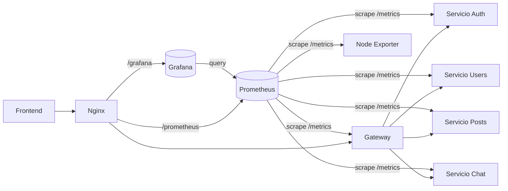

# Sistema de Monitoreo

## Resumen
El subsistema de monitoreo proporciona visibilidad operativa para el backend y la infraestructura de ft_transcendence.

Sus objetivos son:
- Recopilar métricas de ejecución de los servicios de aplicación y de los componentes de infraestructura.
- Proporcionar visualización centralizada del estado de los servicios, la latencia, el tráfico y el comportamiento de recursos.
- Detectar fallos y regresiones de forma temprana mediante reglas de alerta.
- Facilitar la resolución de problemas en una arquitectura de microservicios.

La implementación actual se basa en Prometheus para la recolección de métricas, Grafana para paneles y node-exporter como integración de infraestructura. Prometheus también evalúa reglas de alerta locales.

## Diagrama de Arquitectura

## Stack de Monitoreo
### Prometheus
Prometheus está configurado como el recolector central de métricas. Realiza scrapes sobre servicios de aplicación y node-exporter, además de evaluar reglas de alerta.

### Grafana
Grafana está aprovisionado con una fuente de datos Prometheus y dashboards por archivos. Proporciona vistas operativas y por servicio.

### Exporters e integraciones
- node-exporter: exposición de métricas de host/sistema.

### Endpoints de métricas
Los servicios de aplicación exponen métricas compatibles con Prometheus mediante /metrics.

## Recolección de Métricas
El comportamiento de scrape de Prometheus está definido en la configuración del repositorio:
- Intervalo global de scrape: 10s.
- Timeout global de scrape: 10s.
- Intervalo de evaluación de reglas: 15s.

Los jobs de scrape incluyen:
- nestjs_app: gateway + auth + users + posts + chat.
- node_exporter.
- prometheus (self-scrape).

Endpoints de métricas de aplicación:
- Gateway expone /metrics y endpoints de salud (/health, /health/services).
- Servicio auth expone /metrics.
- Servicio users expone /metrics.
- Servicio posts expone /metrics.
- Servicio chat expone /metrics.

Métricas personalizadas de aplicación implementadas actualmente:
- http_request_duration_seconds (histograma).
- request_count_total (contador con etiquetas de método/ruta/estado).
- El gateway también expone active_users (gauge).

## Exporters e Integraciones
Integraciones implementadas en este repositorio:
- Node exporter: implementado.
- Integración NestJS + prom-client: implementada en gateway/auth/users/posts/chat.

No implementado en este repositorio:
- cAdvisor: no presente.
- Alertmanager: no forma parte del stack principal.
- Nginx exporter: no forma parte del stack principal.
- Exporters de PostgreSQL: no forman parte del stack principal.
- Integraciones de métricas de Kubernetes: no presentes.
- OpenTelemetry/trazabilidad distribuida: no presente.
- Observabilidad basada en ELK: no presente.

La telemetría de infraestructura se representa mediante node-exporter, no mediante cAdvisor.

## Dashboards de Grafana
Dashboards aprovisionados:
- gateway-dashboard.json (uid: gateway-observability)
- auth-service-dashboard.json (uid: auth-service-observability)
- user-service-dashboard.json (uid: users-service-observability)
- posts-service-dashboard.json (uid: posts-service-observability)
- chat-service-dashboard.json (uid: chat-service-observability)

La cobertura de dashboards incluye:
- Estado up del servicio.
- Uptime.
- Uso de CPU.
- Memoria RSS.
- Métricas de heap de Node.js.
- Event loop lag.
- Throughput de requests y tendencia de 5xx.
- Latencia p95 de requests en gateway y servicios instrumentados.

Los dashboards incluyen una variable de plantilla Instance para filtrar por objetivo.

## Reglas de Alerta
Las reglas de alerta de Prometheus están implementadas y cargadas desde el repositorio.

Reglas actuales:
- InstanceDown: detecta objetivos inalcanzables (up == 0, 5m).
- HighErrorRate: detecta ratio elevado de 5xx (> 5% en 5m).
- HighLatency: detecta latencia p95 elevada (> 1s en 5m).
- ExporterDown: detecta fallos en node-exporter.

Las reglas se evalúan dentro de Prometheus. No hay envío de alertas por correo en el stack principal.

Las alertas por umbrales de recursos (saturación de CPU/memoria) no están definidas actualmente en rules.yml.

## Seguridad
El acceso a Grafana está protegido de la siguiente manera:
- El acceso pasa por el endpoint HTTPS de Nginx bajo /grafana/.
- El acceso anónimo está deshabilitado.
- El auto-registro de usuarios está deshabilitado.
- Las credenciales de administrador se proporcionan mediante variables de entorno desde .env.
- Las banderas de seguridad de cookies están habilitadas (secure y samesite).
- Prometheus no está expuesto en un puerto público directo del host; el acceso se hace mediante proxy en Nginx.
- Los servicios están aislados por redes Docker.

Esto proporciona un control de acceso sólido a nivel de módulo sin declarar capacidades de IAM empresarial que no están implementadas aquí.

## Métricas por Servicio
| Servicio | Endpoint de Métricas | Métricas Recopiladas |
|----------|----------------------|----------------------|
| gateway | /metrics | Histograma de duración HTTP, contador de requests, gauge de usuarios activos, métricas Node/proceso |
| auth-service | /metrics | Histograma de duración HTTP, contador de requests, métricas Node/proceso |
| users-service | /metrics | Histograma de duración HTTP, contador de requests, métricas Node/proceso |
| posts-service | /metrics | Histograma de duración HTTP, contador de requests, métricas Node/proceso |
| chat-service | /metrics | Histograma de duración HTTP, contador de requests, métricas Node/proceso |
| node-exporter | /metrics | Métricas de host/sistema |
| prometheus | /metrics | Métricas internas de Prometheus |

## Beneficios Operativos
Esta implementación aporta:
- Visibilidad en tiempo real del estado y rendimiento de servicios.
- Resolución de incidencias más rápida en un backend distribuido al correlacionar señales de servicio e infraestructura.
- Detección temprana de fallos mediante alertado automático.
- Seguimiento continuo de salud y latencia en servicios críticos.
- Mejor análisis de rendimiento mediante tendencias de requests, errores y recursos.

## Conclusión
La implementación del repositorio satisface los requisitos del módulo mayor de monitoreo:

- Recolección de métricas con Prometheus: implementada y configurada.
- Exporters/integraciones: node-exporter implementado como integración de infraestructura.
- Dashboards personalizados de Grafana: implementados por servicio con cobertura operativa.
- Reglas de alerta: implementadas y evaluadas en Prometheus.
- Acceso seguro a Grafana: implementado mediante HTTPS en Nginx, autenticación y exposición restringida.

El subsistema de monitoreo está listo para evaluación y alineado con el alcance declarado del módulo DevOps de ft_transcendence.
